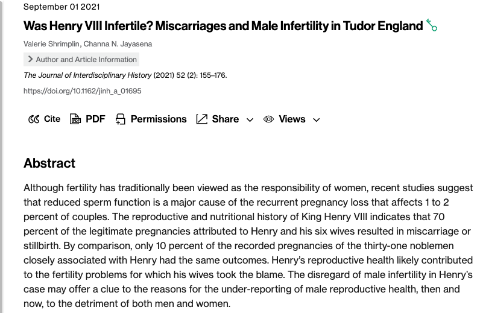

---
jupyter:
  jupytext:
    text_representation:
      extension: .Rmd
      format_name: rmarkdown
      format_version: '1.2'
      jupytext_version: 1.16.4
  kernelspec:
    display_name: Python 3 (ipykernel)
    language: python
    name: python3
---

### Attendance codes

UG: 79887034 
<br>

Masters: 59817179


# Projects -- Our projects require group working

- Group working takes some practice
- Feedback from graduates
  - "I hated group work"
  - "Group work was one of the most valuable experiences in my degree when I think about what I do in my job now"
  - This was the same person

There is a self-directed course on group working here:

group working - "Develop self-awareness about how you work within teams and tools for managing challenging group dynamics"  - students can self-enroll here: <https://canvas.bham.ac.uk/enroll/DXWLP6> "Managing Group Dynamics"

I can't vouch for this course, but you want want to have a look and see if it is useful.

We will cover some of these techniques later


# Project topics
- This is for brain-storming
- You do not need to commit to a topic now
- You do not need (yet) to search for data although that is fine if you want to start
- Groups are self-organizing;  We do not put you in groups
- Please fill in your topic entry - very few are filled in
  - Again - this is for brain-storming


### Data scientist for today:  Ludwig Wittgenstein


- Philosopher
- Born in Austria
- Studied in Cambridge with Bertrand Russell
- Gay man (at a time when that was forbidden)
- Career of two halves
    - Part 1: Show how language could be cast as a logical system (remember Boole?)
    - Part 2: Show how language resisted capture as a logical system  
    
<br>

- Why a data scientist? (many people wouldn't put him in this category, but I think it is useful to think about his insights when thinking about data)
    - Worked on the role of logic and semantics (meaning)
    - This is related to the role of representation (which is related to how data function and what we know about them -- these are very important topics for deep learning)  
    
<br>

- What can we understand from data?
- What are the limits to our understanding?
- What is human? (re: a logical machine (career part 1); not a logical machine (career part 2))
  - Renewed importance now with rise of so-called AI
  - For those interested:  See critique of AI from a historian here: <https://hitchcockian.medium.com/this-is-the-paper-i-gave-to-historians-about-ai-last-week-b1860fd8ecde>
- What is consciousness?

Ultimately these are very important questions.  For example, they might relate to what data are about when we collect them, how we should **use** data and when we shouldn't.


### Consciousness


One of the most mysterious aspects of human nature.  What is it?

Here is what William James, an important early psychologist, had to say about it:

> "The moment we try to fix our attention upon consciousness and to see what, distinctly, it is," says a recent writer, "it seems to vanish. It seems as if we had before us a mere emptiness. When we try to introspect the sensation of blue, all we can see is the blue; the other element is as if it were diaphanous.“
<br>

> (i.e. we can be aware of the **contents** of consciousness, but not consciousness itself)

We will come back to this in part 2 next time...

(James has a famous definition of attention.  If you don't know it, you can find it here: <https://psychclassics.yorku.ca/James/Principles/prin11.htm>. See the third paragraph - "Everyone knows what attention is...")


# Reminder - Where we are, where we are going
### Where we are
| Python | Data concepts |
|--------|---------------|
|Arrays  | Simulation |
| - storing many datapoints ||
|Loops  | Distributions |
| - repeating operations ||
|Data frames (maybe start today, maybe next time) | Translating a real-world problem into a simulation |
|| Calculating the probability of a real-world outcome in data from a simulated world |
|| What was the answer to the Swain Jury problem? |
<br>

### Where we are going
| Python | Data concepts |
|--------|---------------|
| Dataframes | Our first permutation test - Mozzies and beer |
| - big data in rows and columns | Puts everything together |
| - filtering and accessing data in data frames | - taking a sample |
| - Practice - Who has a more unhealthy menu, McDonalds or Starbucks? | - calculating a statistic (e.g. a mean)|
| ```if``` statements-making decisions | - Repeat many times |
|| - Make a distribution |
|| - Compare to the real world |


# A few starting notes...
#### Two kinds of arrays -- NOTE: they work differently

- The basic python array is a ```list```
- You make a list like this (with [])
```
my_python_list = [1,2,3,4,5]
```

Notice what happens when I multiply by 5

```{python}
my_python_list = [1,2,3,4,5]
my_python_list*5
```

#### What has python done?
- With a standard python list, multiplication **repeats** the list


## Another kind of array -- numpy arrays
- The kind of array we will use most often is different
- It is a numpy array
- You make a numpy array like this:
```
my_numpy_array = np.array([1,2,3,4,5])
```

- Notice that there is a python list inside the function.
- ```np.array()``` converts a python list to a numpy array


### Numpy arrays respond differently to operators

What happens with the following:

```{python}
import numpy as np
my_numpy_array = np.array([1,2,3,4,5])
my_numpy_array*5
```

## What is different?
- The values are **not** repeated 5 times
- **_Each_** value is multiplied by 5
<br>

This is **_very_** useful.
- imagine that you have 1000 values
- you need to square all of them

```{python}
# put 0-999 in a numpy array
my_thousand = np.arange(0,1000)

# square them all using this one line
my_thou_squared = my_thousand ** 2

# print some checks
print(my_thou_squared[0:20])
print(my_thou_squared[980:1000])
# check
print("last value in the array is: ",my_thousand[-1])
print("last value squared is: ",my_thousand[-1]*my_thousand[-1])
print("999 times 999 = ",999*999)
```

### Some useful functions to note

- `np.sort` sorts an array
- `np.argsort` returns the locations where lowest to highest values are
- `np.diff` returns the difference between values in an array
  - note that this will be one location shorter than the original array
  - for [1,5,4,6]
  - diff will be [4,-1,2]
- `np.abs` returns absolute values (i.e. sign removed)
- `np.sqrt` returns the square root

### Important note -- These operate on all values in the array
- e.g. abs takes the absolute value of all values
``` my_abs_values = np.abs(my_thousands) ```

- np.diff take the difference between all adjacent values in an array


operate on all values


Vs functions that return one value for the whole array


### Some other useful functions

```
    np.sum
    np.min
    np.max
    np.mean
    np.std (standard deviation)
    len (note, not numpy)
```

#### Unlike the functions above, these return _one_ value based on the entire array
- e.g. there is _one_ minimum value


### The three boys problem generalized

- What is the probability that a family of size Y has X boys?
- Plan:
    - Write a function to calculate the number of boys in a family of size Y
    - Fill an array with results (the number of boys in each family)
    - Use a loop to do this for 100 families
    - How many have X boys (you can choose X and Y values)
    - What is the probability of X?

Extra cool points:
- Do 100 repetitions of your probability based on 100 families
  - You may want to do a another function that returns the probability for Z families (e.g.100), each of size Y (e.g. 4) of having X boys (e.g. 3)
  - What is the _distribution_ of probabilities?
  - At what point would you say a couple has a different than 50/50 chance of a boy?

(Famously King Henry VIII had a problem producing male heirs which he blamed on his wives.  It is more likely that the problem was his.)




### Our working from class

```{python}
# Simulate one family

import numpy as np

def number_of_boys(size_family):
    # NOTE - size_family can only be seen inside the function
    # size_of_family (below) is outside the function
    # it is a separate variable
    family_members = np.full(size_family,np.nan) 
    for i in np.arange(0,size_family):
        family_members[i] = np.random.randint(low=0, high=2)
    num_boys = int(np.sum(family_members))
    return(num_boys)

size_of_family = 6
boys_in_current_family = number_of_boys(size_of_family)
boys_in_current_family
```

```{python}
# simulate 100 families

size_of_family = 6
boys_in_families = np.full(100,np.nan)
for i in np.arange(0,100):
    boys_in_families[i] = number_of_boys(size_of_family)
print(boys_in_families)
```

```{python}
# simulate 100 families and calculate the probabilit of X boys

# let's make the number of families a variable so it
# is easy to change

number_of_families = 100
boys_in_families = np.full(number_of_families,np.nan)

for i in np.arange(0,number_of_families):
    boys_in_families[i] = number_of_boys(size_of_family)

# now we have results from 100 families
# in the array boys_in_families

# calculate the probability of getting boy_number boys
boy_number = 2

# count the total number of families with X (boy_number) boys
# remember that True == 1
families_with_X_boys = np.sum(boys_in_families == boy_number)

# Calculate the probability of X boys
probability = families_with_X_boys/number_of_families
print("The probability of ",boy_number," boys in families of size ",size_of_family)
print(" is equal to ",probability)

# Run this cell several times and see that the number 
# is _about_ the same, but it does also change a bit

# If you increase the number of families you simulate the number
# will change less -- remember larger datasets give more stable
# estimates of things like the probability of X boys

# try it with 1000 or 10000 and see how the number stabilizes
```

### What if we want to know about the range of boys in the result above?
#### What is a common number of boys?
#### What is an uncommon number of boys?

#### Let's make a function out of our 100 families code

```{python}
def simulate_X_families(number_of_families,family_size):
    boys_in_families_result = np.full(number_of_families,np.nan)
    for i in np.arange(0,number_of_families):
        boys_in_families_result[i] = number_of_boys(family_size)
    return(boys_in_families_result)

boys_in_families = simulate_X_families(100,15)
print(boys_in_families)
# this calculates the number of boys in families 
# We simulate ```number_of_families``` families, 
# each of size ``family_size```
# We count the number of boys in each and store that
# We return an array that has the number of boys in each family
```

```{python}
### Let's see how variable the number of boys is
#### We can run our simulation of 100 families

# Henry VIII had at least 15 children - four survived
# and 11 were stillborn or died in infancy
# 2 surviving children were boys

# How likely is that?

import matplotlib.pyplot as plt # we'll do some plotting below

number_of_families_to_simulate = 100
family_size = 15
num_boys = 2 
boys_in_families = simulate_X_families(number_of_families_to_simulate,
                                       family_size)
plt.hist(boys_in_families)

# try with 100, then try with 1000 or 10000
```

## King Henry VIII

- Was 2 boys a rare number?  What was the probability of 2 boys?
- Can we conclude that Henry had trouble producing boys?
<br>

#### Actually, maybe no'

- If we just looked at the frequencies in our plot we could say 'yes'
- But there could be a logical problem.  Can you identify it?
- What was the gender of surviving children?
- What was the gender of children who did not survive?

### What do you conclude?

You may want to see the child record here: <https://kids.kiddle.co/Children_of_Henry_VIII>


<!-- #region -->
<!-- #region -->
### The Swain Jury

#### A Reminder of the problem:


<https://en.wikipedia.org/wiki/Swain_v._Alabama>
<!-- #endregion -->

### Notice the last sentence

> "The overall percentage disparity has been small and reflects
> no studied attempt to include or exclude a specified number of
> Negros"

<sub><sup>(the outdated term for people of colour was in common usage at the time)</sup></sub>

That specified number for "include" would be 0

Was the Supreme Court correct?
<!-- #endregion -->

### Was this an old updated case from the distant past?


The case:
- Fiat factory at Pomigliano
- Union representing workers was called FIOM
- The factory was reorganized
- 4387 total workers were fired
- 382 were members of FIOM
- 1893 workers were re-hired by the reorganized company
- Of the 1893 re-hired, none were members of FIOM
- Or was this anti-union discrimination?

Was 0 re-hired by chance?


### Simulation of chance


Chance based on a simulation of 10 million trials - less than 1 in 10 million (it never occurred)

You can calculate an exact value, but it is hard to comprehend it is so small.
Visualization and an easily understandable result were important for the trial.

The court ordered Fiat to re-hire 145 workers (the mean after some technical issues
around who was a member when were resolved)

A bit of Python (actually R in that case) made a big difference for 145 families


### The Swain Jury
- Will you simulate a fair jury or an unfair jury?
- How do you simulate one fair jury?
  - Remember the makeup of the community (26% vs 74%)
  - How do you simulate the community?
  - How do you pick 12 people at random from the community?
  - What is the difference between "with replacement" and "without replacement"?
  - Which do you want?
- One jury is only a single value.  What is the **range** of values you expect if the jury selection was fair?
- To simulate the fair world, what steps do you need to repeat?
- Which values will you store?
- How will you calculate the probability of a jury with 0 black members?
